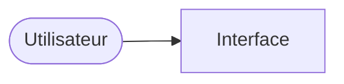

# Choix techniques – {{NOM_DU_PROJET}}

> Produit par `/pulse:tech` le {{DATE}}. Ce document explique **avec quoi** l'outil est construit, et **pourquoi**. C'est la source unique pour la spec, le plan et le code. Il reste lisible par une personne non technique.

## En une phrase

{{NOM_DU_PROJET}} est construit avec {{pile retenue, en mots simples}}, hébergé sur {{hébergeur}}, pour un coût mensuel estimé de {{montant}}.

## Les besoins qui guident le choix

| Question | Réponse | Ce que ça implique |
|---|---|---|
| Qui utilise l'outil, et combien de personnes dans 6 mois ? | | |
| Les données sont-elles partagées entre plusieurs personnes ? | | |
| Faut-il des comptes (connexion) ? Des rôles (admin) ? | | |
| Données personnelles ou sensibles ? (loi applicable) | | |
| Services externes (email, paiement, carte, IA…) | | |
| Plateforme (ordinateur, téléphone, hors ligne) | | |
| Visibilité sur les moteurs de recherche importante ? | | |
| Budget mensuel pour les services | | |
| Expérience technique de la personne ou de l'équipe | | |
| Contraintes (localisation des données, outil imposé, exclusion) | | |

## Les options comparées

| Option | Pile | Hébergement | Coût / mois | Points forts | Risques | Verdict |
|---|---|---|---|---|---|---|
| **A** | | | | | | ✅ / ⚠️ / ❌ |
| **B** | | | | | | ✅ / ⚠️ / ❌ |

## Pile retenue

| Élément | Choix | Version | Pourquoi (en une phrase) |
|---|---|---|---|
| Langage(s) | | | |
| Framework (ou aucun) | | | |
| Données (stockage) | | | |
| Connexion des utilisateurs (ou aucune) | | | |
| Code serveur (ou aucun) | | | |
| Hébergement | | | |
| Services externes | | | |

## Comment les pièces s'assemblent



{{2 ou 3 phrases : qui parle à qui, où sont les données, où sont les secrets.}}

## Organisation des fichiers

> Projet existant : l'organisation observée dans le code. Projet neuf : l'organisation décidée (les dossiers sont créés au fil des tâches).

```
{{arborescence}}
```

## Commandes du projet

| Action | Commande |
|---|---|
| Installer les dépendances | {{commande ou « aucune »}} |
| Lancer en local | {{commande, et adresse à ouvrir}} |
| Tester | {{commande ou « aucune »}} |
| Contrôles automatiques (lint, format, types) | {{commandes ou « aucune »}} |
| Construire | {{commande ou « aucune »}} |
| Déployer | {{automatique à chaque envoi sur la branche principale, ou commande}} |

## Données et contrôle d'accès

- Où sont les données : {{…}}
- Qui peut lire, créer, modifier, supprimer quoi : {{…}}
- Où ce contrôle est vérifié côté serveur ou dans la base : {{…}}

## Secrets et variables d'environnement

- Fichier local non versionné : {{nom du fichier}} ; modèle versionné sans valeur : `.env.example`.
- Variables : {{NOM — rôle — côté serveur ou public}}
- En production : à saisir par la personne dans {{l'hébergeur}}. Les valeurs ne sont jamais collées dans la conversation.

## Hébergement et mise en ligne

- Dépôt distant : {{…}}
- Hébergeur : {{…}} ; mise en ligne : {{automatique à chaque envoi / manuelle}}
- Contrôle automatique avant mise en ligne (CI) : {{outil, ou « à mettre en place avec /pulse:cicd »}}

## Mise en place

Ce qu'il faut créer ou installer avant la première tâche (comptes, squelette du projet, commandes). Les clés secrètes ne sont **jamais** collées dans la conversation.

1. {{étape}}

## Ce qu'on a écarté

- {{option}} : {{pourquoi}}
